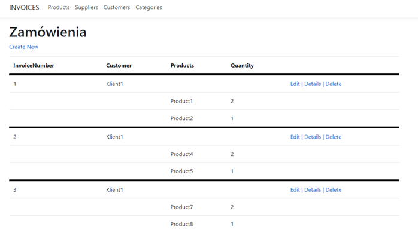
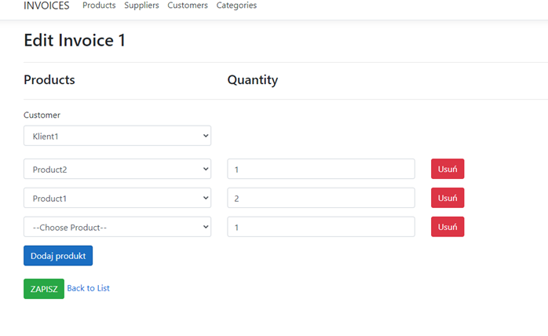
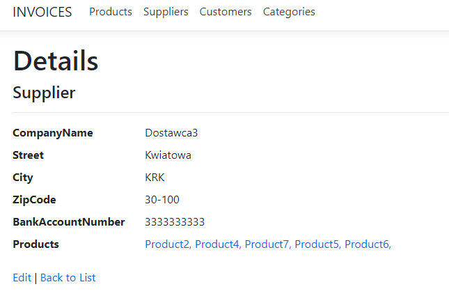
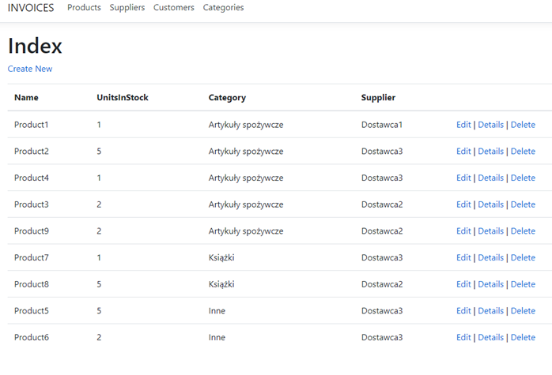

# Orders_web_app_EF_Core
1. widok zamówień  

2. edycja/dodawanie zamówienia  

3. detale dostawcy  

4.lista produktów  

5. analogiczne/podobne widoki dla lity/detali/dodawania/edycji/usuwania Prodktów, Zamówień, Dostawców, Klientów, Kategorii.
